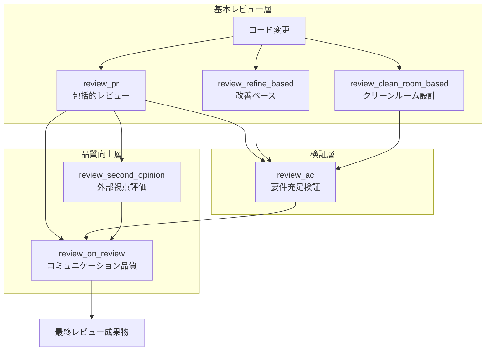

# 🎯 高品質コードレビューシステム ガイド

## 📋 概要
このガイドは、複数のレビューコマンドを組み合わせて、包括的で高品質なコードレビューを実現するためのフレームワークです。

## 🏗️ レビューシステムの構造



## 📚 各レビューコマンドの役割

### 1️⃣ 基本レビュー層

#### `/review_pr` - 包括的コードレビュー
- **目的**: Google流のエンジニアリングプラクティスに基づく総合的なレビュー
- **焦点**: ビジネスコンテキスト、アーキテクチャ整合性、長期的なコード健全性
- **使用場面**: PR全体の包括的レビュー、設計判断の評価

#### `/review_refine_based` - 改善ベースレビュー
- **目的**: 既存コードからの改善点に焦点を当てたレビュー
- **焦点**: リファクタリング機会、パフォーマンス改善、技術的負債の削減
- **使用場面**: 継続的改善、既存機能の拡張時

#### `/review_clean_room_based` - クリーンルーム設計レビュー *(未実装)*
- **目的**: 仕様から独立して設計案を作成し、実装との差分を分析
- **焦点**: 設計の妥当性、代替アプローチの探索
- **使用場面**: 重要な新機能、アーキテクチャ変更時
- **注**: 現在は手動実施。SubAgent/マルチペルソナ実装待ち

### 2️⃣ 検証層

#### `/review_ac` - 受け入れ基準ベースレビュー
- **目的**: ACに対する厳密な充足性検証
- **焦点**: テストケース網羅性、要件トレーサビリティ
- **使用場面**: 機能実装の完了判定、リリース前検証

### 3️⃣ 品質向上層

#### `/review_second_opinion` - セカンドオピニオン
- **目的**: プロジェクト文脈を排除した純粋な技術評価
- **焦点**: 業界標準、セキュリティ、パフォーマンス、将来の技術的負債
- **使用場面**: 重要な設計判断、外部監査準備

#### `/review_on_review` - レビュー品質評価
- **目的**: レビューコメントの質と伝え方の改善
- **焦点**: 具体性、論理性、トーン、バランス
- **使用場面**: チームの心理的安全性向上、レビュー文化の醸成

## 🔄 推奨レビューフロー

### パターン1: 標準的なPRレビュー
```bash
1. /review_pr                    # 基本的な包括レビュー
2. /review_second_opinion         # 外部視点での補完
3. /review_on_review              # レビューの品質向上
```

### パターン2: 機能実装の厳密検証
```bash
1. /review_ac                     # AC充足性の検証
2. /review_pr                     # 実装品質の評価
3. /review_on_review              # フィードバックの調整
```

### パターン3: アーキテクチャ変更の評価
```bash
1. (手動) Clean Room設計を構想    # 理想設計との比較
2. /review_pr                     # 実装の評価
3. /review_second_opinion         # 業界標準との照合
4. /review_on_review              # 建設的なフィードバック化
```

### パターン4: 技術的負債の削減
```bash
1. /review_refine_based           # 改善機会の特定
2. /review_second_opinion         # 優先度の客観評価
3. /review_on_review              # アクション可能な提案へ
```

## 💡 効果的な活用のコツ

### 1. レイヤーの組み合わせ
- **基本 + 検証**: 機能の正確性を保証
- **基本 + 品質向上**: コミュニケーションとチーム学習を促進
- **全層統合**: ミッションクリティカルな変更に対する完全な保証

### 2. 段階的適用
```yaml
軽微な変更:
  - review_pr のみ

通常の機能追加:
  - review_pr
  - review_ac (ACがある場合)

重要な変更:
  - review_pr
  - review_second_opinion
  - review_on_review

アーキテクチャ変更:
  - 全コマンドを適用
```

### 3. チーム成熟度に応じた活用
- **初期段階**: review_pr + review_on_review で基礎を固める
- **成長段階**: review_ac を追加して品質を向上
- **成熟段階**: 全コマンドを活用して卓越性を追求

## 📊 メトリクスと改善

### 追跡すべき指標
1. **AC充足率**: review_ac での要件カバレッジ
2. **技術的健全性スコア**: review_second_opinion の評価点
3. **レビュー品質スコア**: review_on_review の4軸評価
4. **改善提案の実装率**: 提案から実装への転換率

### 継続的改善サイクル
```
1. レビュー実施
   ↓
2. メトリクス収集
   ↓
3. パターン分析
   ↓
4. プロセス改善
   ↓
5. チーム学習
   ↓
(1に戻る)
```

## 🎯 期待される成果

### 短期的効果（1-2週間）
- バグの早期発見
- コードの一貫性向上
- レビューの効率化

### 中期的効果（1-3ヶ月）
- 技術的負債の削減
- チームの技術力向上
- 心理的安全性の確立

### 長期的効果（3ヶ月以上）
- アーキテクチャの健全性維持
- 自律的な品質文化の定着
- 継続的な学習組織の実現

## 🚀 クイックスタート

### 今すぐ始める3ステップ
```bash
# Step 1: 基本レビューを実施
/review_pr PR番号

# Step 2: 外部視点を追加
/review_second_opinion

# Step 3: フィードバックを洗練
/review_on_review
```

### チームへの導入
1. このガイドをチームで共有
2. 小さなPRから試験的に開始
3. 振り返りで効果を測定
4. 徐々に適用範囲を拡大

## 📝 コマンドリファレンス

| コマンド | 入力 | 出力 | 所要時間 |
|---------|------|------|----------|
| `/review_pr` | PR番号 or diff | 包括的レビューレポート | 5-10分 |
| `/review_ac` | AC + diff | 充足性検証レポート | 5-10分 |
| `/review_second_opinion` | diff | 外部視点評価 | 3-5分 |
| `/review_on_review` | レビューコメント | 品質改善提案 | 3-5分 |
| `/review_refine_based` | diff | 改善提案リスト | 3-5分 |
| `/review_clean_room_based` | *(未実装)* | 設計比較分析 | - |

## 🔧 カスタマイズ

### プロジェクト固有の調整
```yaml
# .claude/review_config.yml (例)
review_priorities:
  security: high
  performance: medium
  maintainability: high
  
excluded_patterns:
  - "generated/*"
  - "*.min.js"
  
custom_checks:
  - api_versioning
  - error_handling_consistency
```

---

*このガイドは継続的に改善されます。フィードバックや改善提案は歓迎します。*

## 補足: Clean Room Based レビューの詳細

### Clean Room Basedアプローチとは
仕様から独立して「理想的な設計」を考案し、実際の実装と比較する手法です。

### 🚨 重要な注意事項
**Clean Room Basedレビューは現在、専用の`/command`として実装されていません。**

理由：
- 設計者とレビュアーの完全なコンテキスト分離が必要
- SubAgentやマルチペルソナの高度な活用が前提
- 適切な実装には追加の技術的検討が必要

### 現在の利用方法
```bash
# 手動でClean Roomアプローチを実施する場合：

# 1. 仕様のみを基に理想設計を考える
# （既存コードを見ずに、要件から設計を構想）
# 例: gemini-cliのdeep-planningを使用
cd ~/gemini-cli
gemini deep-planning "仕様やACをここに記述"

# 2. 通常のレビューを実施
/review_pr PR番号

# 3. 理想設計と実装の差分を手動で分析
# - なぜ違いが生まれたか？
# - どちらのアプローチが優れているか？
# - 学びは何か？
```

### 実践例：gemini-cli活用パターン
```bash
# Step 1: gemini-cliで独立した設計を作成
# yonai/gemini-cli/commands/deep-planning.toml を使用
gemini deep-planning \
  --requirements "要件やACを入力" \
  --output design.md

# Step 2: 実装レビュー
/review_pr PR番号

# Step 3: 設計比較と洞察抽出
# design.mdと実装を比較して以下を分析：
# - アーキテクチャの違い
# - 抽象化レベルの差
# - トレードオフの判断基準
```

### 将来の実装計画
- SubAgent活用による自動化
- 複数ペルソナによる独立設計
- 設計差分の自動分析機能

### メリット（手動実施でも有効）
- 既存の制約に縛られない発想
- 隠れた前提条件の発見
- 代替アプローチの探索

