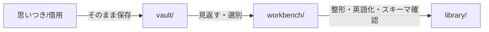

# vault ガイドライン

## 役割
- Claude Code コマンドの掃き溜め  
  思いつき、借用、未整理の断片をひたすら放り込む場所。  
- 一次保管庫  
  完成品ではなく「原石」を置く。誤字脱字、構造崩れ、言語の混在は気にしない。  
- 探索のための貯蔵庫  
  あとで見返したときに「これを磨けば使える」と気づけるようにストックしておく。  

## 目的
- 自由に貯めることが第一  
  完成度を気にせず保存することでアイデアを失わない。  
- ブラッシュアップ候補を見つける  
  まとまってきたものは `workbench/` に移動して整える。  
- 情報の流れをシンプルにする  
  vault → workbench → library の3段階で管理する。  

## ワークフロー

## ステップ詳細
1. **収集**  
   - どんな形でも `vault/` に保存する。  
   - ファイル名は英語。中身は日本語混じりでも構わない。  
   - 命名例：`raw-idea-smartHR-dto.md`  

2. **見返し**  
   - 週1回など決まったタイミングで見直す。  
   - 「使えそう」「捨ててもよい」を軽く判定する。  

3. **昇格**  
   - 磨きたいものを `workbench/` へ移動する。  
   - 英語化、構造化、タグ付けなどをここで行う。  

## ディレクトリ構成ルール
- 日付ごとにサブディレクトリを作成すること
- 精査済みかどうかをディレクトリ名で明示すること
  - 例:
    - `2025-09-01_raw/` （収集したばかりの未精査ファイルを格納）
    - `2025-09-01_reviewed/` （見返し済み、一次判定を終えたファイルを格納）

## 注意点
- `vault/` は **きれいさより量を優先**する。  
- 迷ったら「とりあえず vault に入れる」。  
- **直接 `library/` に移さない**。必ず `workbench/` を経由する。  
- 個人メモや実験コードも歓迎。後で使えるかもしれない。  

